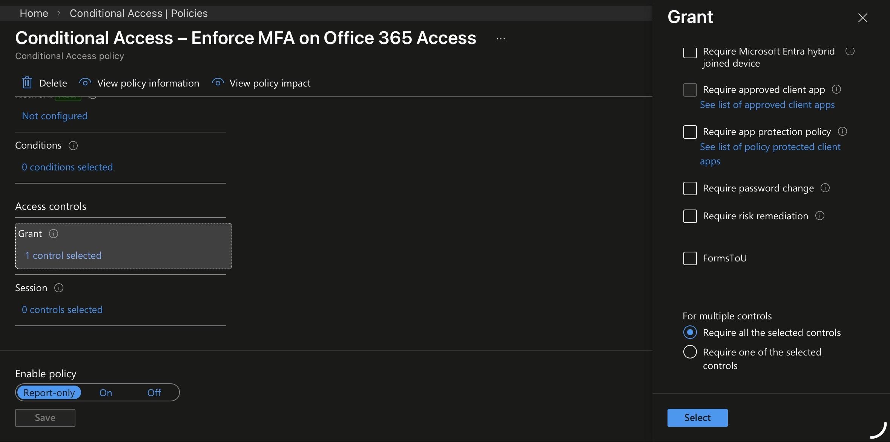
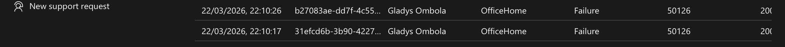
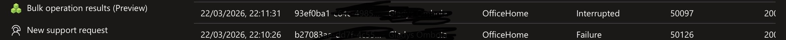
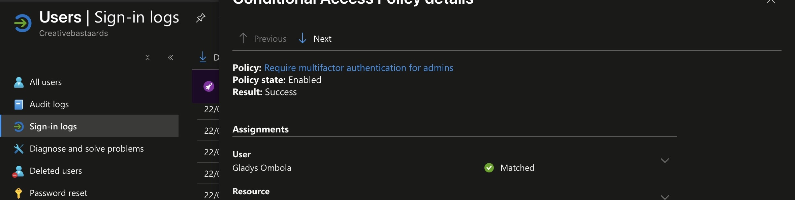
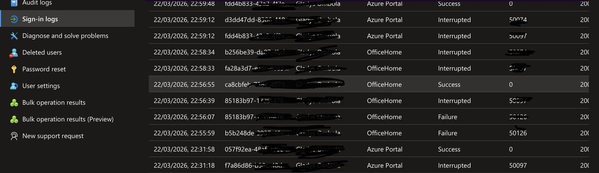
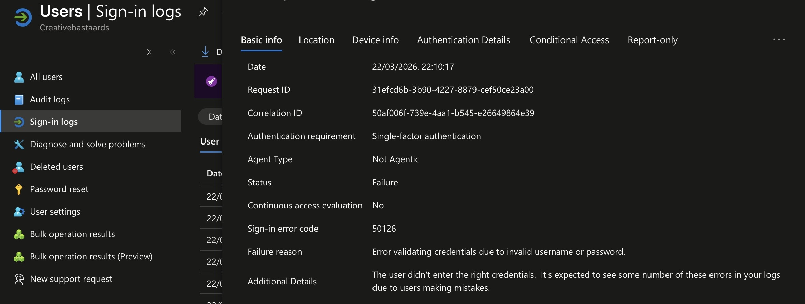
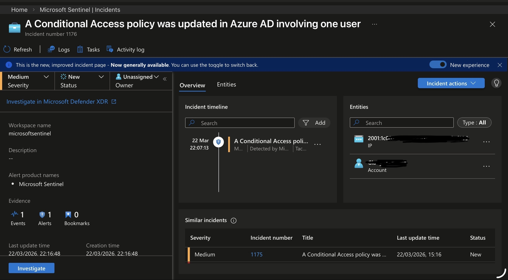

## Overview
This lab demonstrates how Conditional Access policies in Microsoft Entra ID can be used to enforce MFA and how authentication attacks can be detected using Microsoft Sentinel and Microsoft Defender XDR.

## Objectives
- Enforce MFA using Conditional Access
- Simulate authentication attacks
- Analyze Entra ID sign-in logs
- Detect MFA fatigue using KQL
- Generate and investigate incidents

## Architecture

Describe flow:
User → Entra ID → Conditional Access → Logs → Sentinel → Incident → Defender XDR

## Lab Setup
- Test users
- Security group
- Break-glass account (excluded)

## Conditional Access Policy

A policy was created to enforce MFA for a controlled user group accessing Office 365, while excluding a break-glass account to prevent administrative lockout.




## Attack Simulation

Scenario 1: Credential Guessing

- Multiple failed logins
- Result: authentication failure



Scenario 2: MFA Fatigue Simulation

- Correct password + MFA not approved
-	Result: interrupted login



Scenario 3: Legitimate Access
-	MFA approved
-	Result: successful login



## Log Analysis

Authentication events were analyzed using sign-in logs in Microsoft Entra ID to validate Conditional Access behavior.

Key Observations

- Error 50126 — Invalid username or password
- Observed during failed login attempts
- Indicates credential guessing or brute-force activity
  
- Error 500121 — MFA required but not satisfied
- Observed when MFA prompt was not approved
- Simulates MFA fatigue or user interruption
  
- Conditional Access Behavior
- Policies are only evaluated after successful primary authentication
- Failed logins (50126) show “Not applied”
- MFA events (500121) show policy enforcement





## Detection Engineering

A detection rule was created in Microsoft Sentinel to identify patterns of credential guessing followed by MFA interruption within a short time window.


This scenario simulates a combination of:

- Credential guessing (brute-force attempts)
- MFA fatigue attack (user targeted with repeated MFA prompts)

  - Monitor failed logins (Error 50126)
	-	Monitor MFA interruptions (Error 500121)
	-	Correlate both events per user
	-	Use a 5-minute time window
	- Trigger alert when:
	-	≥2 failed attempts
	-	≥1 MFA interruption

### Detection Query (Credential Guessing + MFA Fatigue)

This query identifies users with multiple failed logins followed by MFA interruptions within a 5-minute window.

```kql
let TimeWindow = 30m; let FailedThreshold = 2; let MFAInterruptThreshold = 1; let FailedLogins = SigninLogs | where TimeGenerated > ago(TimeWindow) | where Status.errorCode == "50126" | summarize FailedCount = count(), FailedIPs = make_set(IPAddress) by UserPrincipalName, bin(TimeGenerated, 5m); let MFAInterruptions = SigninLogs | where TimeGenerated > ago(TimeWindow) | where Status.errorCode == "500121" | summarize InterruptedCount = count(), InterruptedIPs = make_set(IPAddress) by UserPrincipalName, bin(TimeGenerated, 5m); FailedLogins | join kind=inner MFAInterruptions on UserPrincipalName, TimeGenerated | where FailedCount >= FailedThreshold and InterruptedCount >= MFAInterruptThreshold | extend TotalAttempts = FailedCount + InterruptedCount | project TimeGenerated, UserPrincipalName, FailedCount, InterruptedCount, TotalAttempts>
          TotalAttempts
```

Frequency: 15 minutes
- Lookup period: 30 minutes
- Grouping: by UserPrincipalName
- Incident creation: Enabled

This detection identifies early-stage identity attacks that bypass simple MFA enforcement by exploiting user behavior. It improves visibility into authentication abuse patterns that are often missed in isolated log analysis.

## Incident Investigation

An incident was generated in Microsoft Sentinel based on the detection rule for suspicious authentication patterns.

- Incident Name: Identity Attack Pattern: Credential Guessing + MFA Fatigue  
- Severity: Medium  
- Time Created: 2026-03-22 22:15 UTC  
- Status: Active  

Entities Identified
- UserPrincipalName: xxx@omnimicrosoft.com
- IP Addresses: 192.168.1.10, 192.168.1.15  
- Location: Trusted country (Netherlands)  

Alert Evidence
- Failed Logins: 2 attempts (Error 50126 – invalid username or password)  
- MFA Interruptions: 1 attempt (Error 500121 – MFA not satisfied)  
- Correlation Window: Events occurred within 5 minutes  

## MITRE ATT&CK Mapping
- T1110 – Brute Force
- T1621 – Multi-factor Authentication Fatigue

## Key Security Insights

Identity Protection
- Conditional Access enforces security controls after primary authentication  
- Failed logins (50126) occur before policy evaluation

MFA Limitations
- MFA alone is not sufficient to stop MFA fatigue attacks  
- Users can be targeted with repeated push notifications  

Detection Importance
- Correlating failed logins with MFA interruptions improves visibility  
- Single-event analysis is insufficient for identifying complex attack patterns  

Operational Recommendations
- Always maintain a break-glass account for emergency access  
- Monitor and review policy exclusions regularly  
- Combine Conditional Access with SIEM detections for holistic identity protection  

Real-World Application
  - Organizations should implement:
  - Conditional Access policies for MFA enforcement  
  - Correlation-based detection rules in Microsoft Sentinel  
  - Unified monitoring with Defender XDR for incident verification
